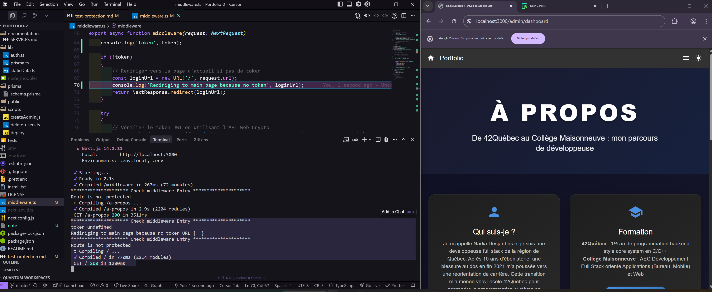
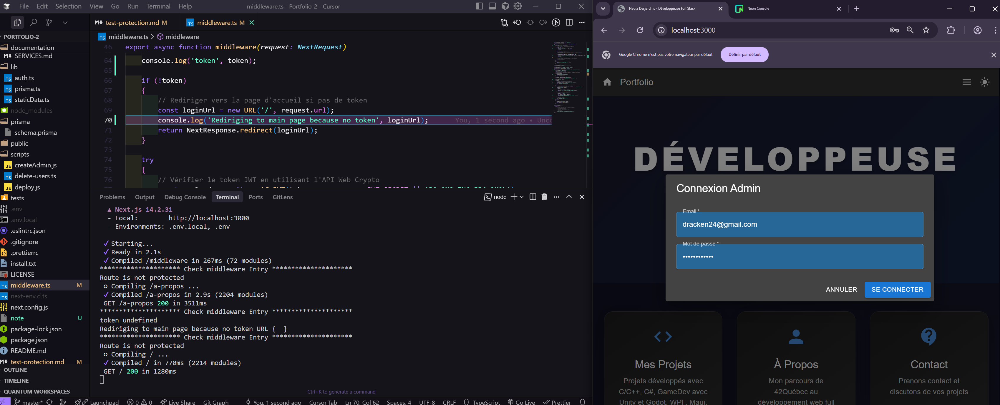
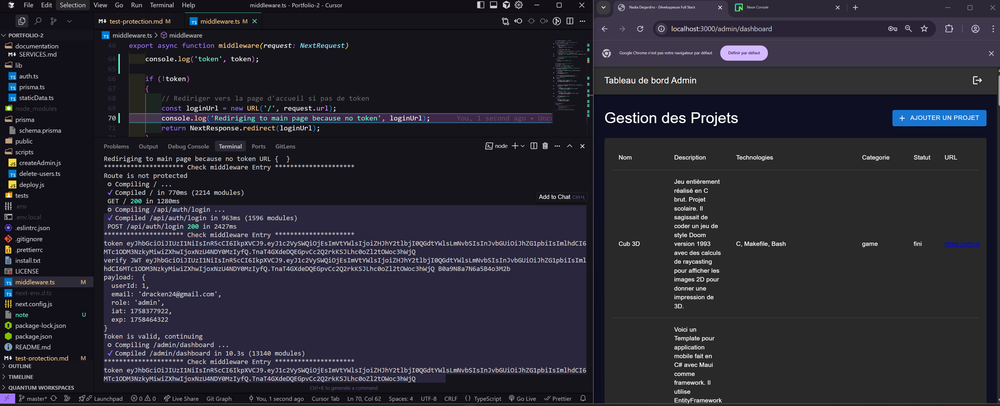
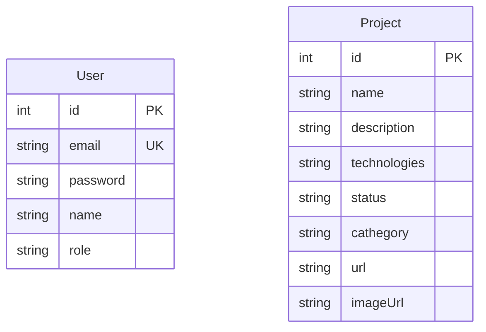
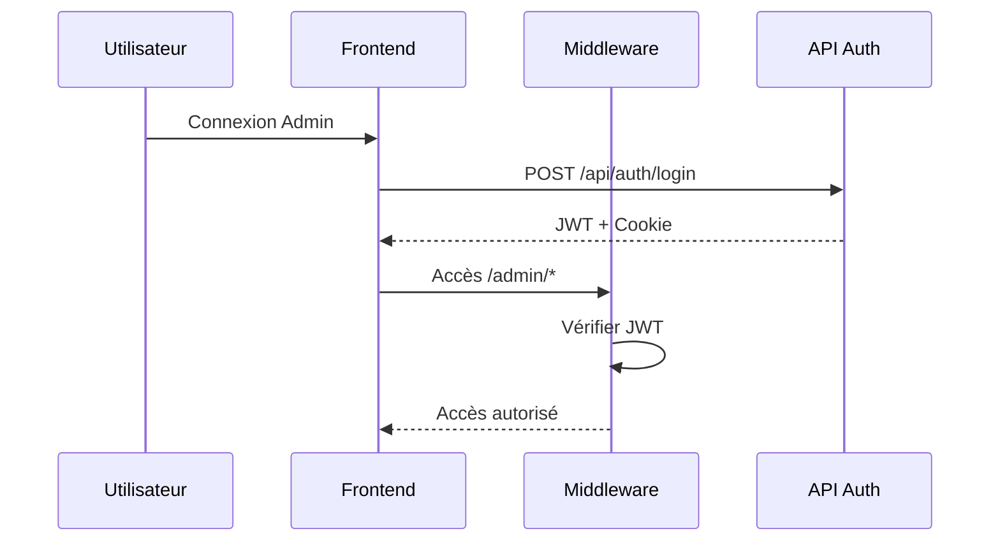

# Portfolio FullStack - Documentation

## 1. Installation & Configuration

### Prérequis
- Node.js 18+
- Compte Neon.tech

### Installation
```bash
git clone https://github.com/dracken24/Portfolio-2.git
cd Portfolio-2
npm install
npx prisma generate
```

### Configuration
1. Créer fichier `.env` :
```env
DATABASE_URL="postgresql://..."
JWT_SECRET="votre_secret_jwt_ici"
```

2. Initialiser la DB :
```bash
npx prisma db push
npx ts-node scripts/createAdmin.js
```

### Exécution
```bash
npm run dev  # http://localhost:3000
```

### Tests de Sécurité
1. **Accès direct** : `http://localhost:3000/admin/dashboard` → Redirection
   

2. **Connexion** : Login admin → Dashboard accessible
   
   

3. **API** : Utiliser `tests/api.http`

## 2. API Endpoints

### Base URL
```
http://localhost:3000
```

### Authentification
JWT Token via cookie `adminToken` ou header `Authorization: Bearer <token>`

### Endpoints Principaux

#### POST /api/auth/login
```bash
curl -X POST http://localhost:3000/api/auth/login \
  -H "Content-Type: application/json" \
  -d '{"email":"admin@********, portfolio********.com","password":"8888888888"}'
```

#### GET /api/projects
```bash
curl -X GET http://localhost:3000/api/projects
```

#### POST /api/projects (Admin)
```bash
curl -X POST http://localhost:3000/api/projects \
  -H "Content-Type: application/json" \
  -H "Authorization: Bearer TOKEN" \
  -d '{"name":"Projet","description":"Desc","technologies":"React","status":"En cours","cathegory":"Web"}'
```

#### PUT /api/projects/[id] (Admin)
```bash
curl -X PUT http://localhost:3000/api/projects/1 \
  -H "Content-Type: application/json" \
  -H "Authorization: Bearer TOKEN" \
  -d '{"name":"Projet Modifié","description":"Nouvelle desc","technologies":"React","status":"Terminé","cathegory":"Web"}'
```

#### DELETE /api/projects/[id] (Admin)
```bash
curl -X DELETE http://localhost:3000/api/projects/1 \
  -H "Authorization: Bearer TOKEN"
```

### Codes d'erreur
- **400** : Données invalides
- **401** : Non autorisé
- **404** : Non trouvé
- **500** : Erreur serveur

## 3. Architecture

### Schéma de Base de Données


### Flux d'Authentification


## Sécurité Implémentée

1. **Middleware Next.js** : Protection routes `/admin/*`
2. **JWT + Cookie httpOnly** : Authentification sécurisée
3. **bcrypt** : Hachage des mots de passe
4. **Validation** : Champs requis vérifiés
5. **Redirection** : Auto-redirection si non authentifié

